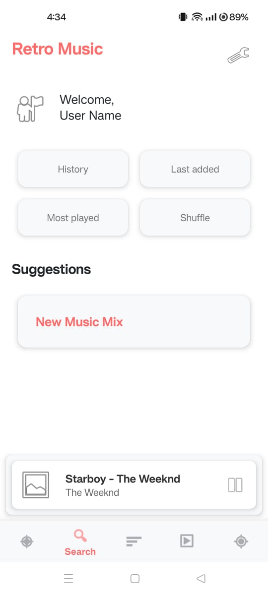
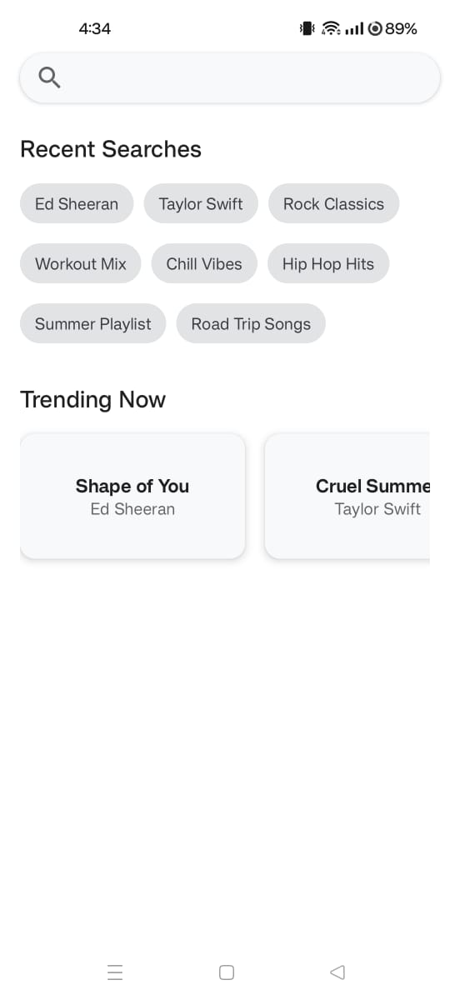
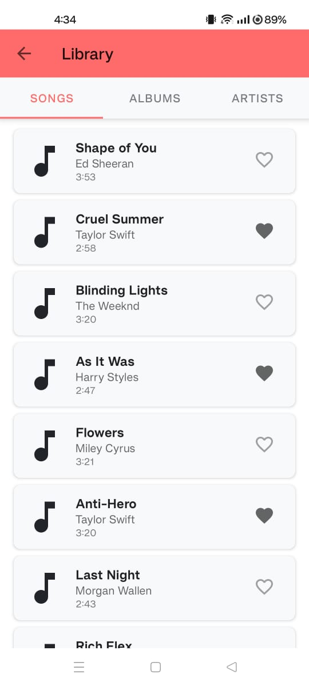
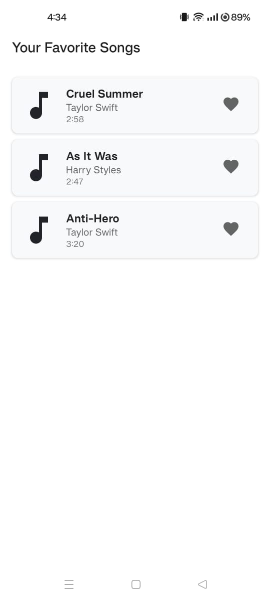

# Music App UI Design

This repository contains the UI design implementation of a Music App created using Android Studio. The project focuses solely on the user interface design, and the functionalities are not implemented.

## Features (UI Only)
- Modern and intuitive music player interface
- Search functionality design
- Library view layout
- Custom icons and drawables
- Responsive layouts for different screen sizes

## Note
This is a demonstration of UI/UX design skills. The app's functions (like playing music, searching, etc.) are not implemented. This is purely a design showcase.

## Tools & Technologies Used
- Android Studio
- XML Layouts
- Custom Vector Drawables
- Material Design Components

## Screenshots

    
    
    
    

## License
This project is open source and available under the MIT License.
